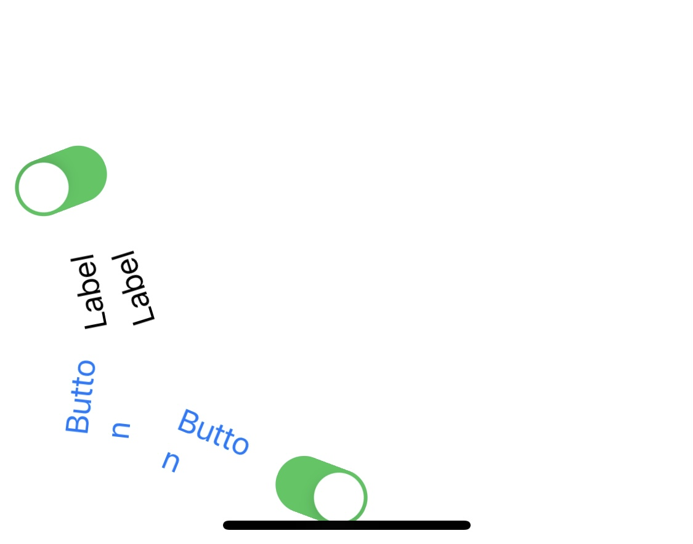

# Gravity

--

**Gravity** is a simple *Swift Package* to add gravity to UI objects easily.




--

### How to use:

Add a new *Swift Package* from XCode and paste the url of this repository (https://github.com/elpsk/Gravity).

Next, import the SDK:

```import GravitySPM```


Add your **IBOutlets** or your custom views:

```
@IBOutlet weak var label1: UILabel!
@IBOutlet weak var label2: UILabel!
@IBOutlet weak var button1: UIButton!
@IBOutlet weak var button2: UIButton!
@IBOutlet weak var switch1: UISwitch!
@IBOutlet weak var switch2: UISwitch!

var gravity: Gravity?
```

Next, attach your desidered items to a new `UIDynamicItem` array:

```
let gravityItems: [UIDynamicItem] = [
	label1, label2, button1, button2, switch1, switch2
]
```

and create a new Gravity object with desidered params:

```
gravity = Gravity(
    gravityItems: gravityItems,
    collisionItems: nil,
    referenceView: self.view,
    boundary: UIBezierPath(rect: self.view.frame),
    queue: nil)
```

Now you're ready to `enable()` or `disable()` the behavior.

```
@IBAction func didEnablePressed(_ sender: Any) {
    gravity?.enable()
}

@IBAction func didDisablePressed(_ sender: Any) {
    gravity?.disable()
}
```

Have fun.

--

Detailed info here: [https://www.albertopasca.it/whiletrue/swift-have-fun-with-gravitybehavior-and-dynamicanimator/](https://www.albertopasca.it/whiletrue/swift-have-fun-with-gravitybehavior-and-dynamicanimator/) or [here](https://www.albertopasca.it/whiletrue).

